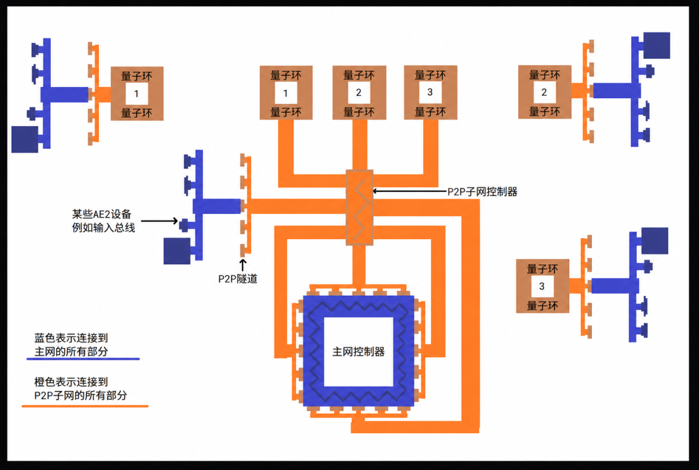

---
navigation:
  title: P2P通道
  parent: ae2-mechanics-index.md
  icon: appliedenergistics2:item.ItemMultiPart:460

item_ids:
  - appliedenergistics2:item.ItemMultiPart:460
  - appliedenergistics2:item.ItemMultiPart:461
  - appliedenergistics2:item.ItemMultiPart:462
  - appliedenergistics2:item.ItemMultiPart:463
  - appliedenergistics2:item.ItemMultiPart:466
  - appliedenergistics2:item.ItemMultiPart:467
  - appliedenergistics2:item.ItemMultiPart:468
  - appliedenergistics2:item.ItemMultiPart:470
  - appliedenergistics2:item.ItemMultiPart:471
  - appliedenergistics2:item.ItemMultiPart:472
  - ae2fc:part_fluid_p2p_interface
---

# P2P通道

# 什么是P2P通道

P2P通道是一种在网络中传输物品、流体、红石信号、电力、光线和[频道](./channels.md)等事物的系统，在GTNH中你还可以用它并发样板。P2P通道有许多变体，每种变体只能传输特定类型的事物。P2P通道有明确的输入端与输出端，单向流通且不可反转。P2P通道支持多输出端但只支持单输入端。

# <ItemLink id="appliedenergistics2:item.ItemMultiPart:460" showIcon="true"/>

P2P通道-ME是传输AE频道的P2P通道，它可以让你将至多32个频道传输至所有输出端（所有输出端共用输入端的频道）。与其他P2P通道不同的是，P2P通道-ME本身需要在被传输的网络之外的AE网络上运行。

- P2P通道-ME简易用例

场景中黄色的无控制器小型AE独立网络将左侧控制器的32个频道传递至右侧，此时每个ME终端各使用一个频道。
  <GameScene zoom="4" background="transparent" width="400">
    <ImportStructure src="../assets/structures/p2p-me.snbt" />
    <IsometricCamera yaw="-60" pitch="30" />
  </GameScene>

- P2P通道-ME规模化用例
  
  场景中黄色的拥有控制器的独立AE网络专职传输ME频道,P2P可以通过线缆传输也可以通过量子环传输。

<GameScene zoom="3" background="transparent" width="400">
  <ImportStructure src="../assets/structures/compact-p2p-me.snbt" />
  <IsometricCamera yaw="-60" pitch="30" />
</GameScene>
  
- 下面是典型的使用P2P通道传输大量ME频道的网络架构。

  

# P2P通道的变体

<GameScene zoom="3" interactive={false} allowLayerSlider={false}>
  <ImportStructure src="../assets/structures/p2p_tunnels.snbt" />
  <IsometricCamera yaw="180" pitch="0" />
</GameScene>

## 不同P2P通道的获取方法
在原版AE2中，处于生存模式的玩家只能制作P2P通道-ME，通过手持特定物品右键P2P通道-ME可以将其转化为对应种类的P2P通道。使用<ItemLink id="appliedenergistics2:item.ToolMemoryCard" showIcon="true"/>来连接P2P通道，Shift+右键绑定输入端，右键绑定输出端。GTNH中新增了两种新的P2P通道，它们可以通过工作台合成。
- P2P通道 - ME,使用任意[ME线缆](../items-blocks/cables.md)右键来转化。
- P2P通道 - 红石，使用任意红石元件右键来转化。
- P2P通道 - 物品，使用箱子或者桶右键来转化。
- P2P通道 - 流体，使用桶、水瓶或者任意<ItemImage id="EnderIO:itemLiquidConduit:0" label="right"/>来转化。
- P2P通道 - RF，使用任意<ItemImage id="EnderIO:itemPowerConduit:0" label="right"/>右键来转化。
- P2P通道 - 光，使用火把或者荧石右键来转化。
- P2P通道 - OC，使用<ItemImage id="OpenComputers:cable" label="right"/>右键来转化。
- P2P通道 - 声音，通过音符盒右键来转化。
- P2P通道 - GT EU，通过任意GT导线或GT线缆右键来转化。
- P2P通道 - ME接口， <RecipesFor id="appliedenergistics2:item.ItemMultiPart:471" />
- P2P通道 - ME二合一接口， <RecipesFor id="ae2fc:part_fluid_p2p_interface" />

这些变体P2P使用方法与特性与P2P通道 - ME基本相同，<Color id="YELLOW">但其中有几点特性需要特别指出</Color>：

- 物流类型的P2P通道会经尽可能地将输入**均分**给所有输出端。
- P2P通道-物品与P2P通道-流体并没有内置动力，单纯的使用P2P通道将两端连接并不能运输内容物，必须在输入端提供输入动力（例如漏斗、电动泵等）或在输出端提供抽出动力才能使内容物完成传输。
- P2P通道-流体可以双向传输，但仍然只能有一个输入端。
- 在GTNH的AE2中使用P2P通道 - GT EU时会受到电压惩罚，从P2P通道 - GT EU输出端输出的电能每安电流需要交5%的电压税，例如输入端输入8192V 16A，则对应的输出端输出7782V 16A。

## <ItemLink id="appliedenergistics2:item.ItemMultiPart:471" showIcon="true"/>与<ItemLink id="ae2fc:part_fluid_p2p_interface" showIcon="true"/>
GTNH新增的两种P2P通道，它们并非用于传输，而是与接口/二合一接口一样用于发送样板材料。所以下面场景中的红色标记处的用法不生效，样板并不能被P2P通道-接口/二合一接口传递到输出端，而是应当被放置在**输入端**中，此时输入端与输出端均可以向紧贴的方块发送样板材料。如果有端口正对不可接受材料的方块则此处被忽略。每个面板均具有[接口](../items-blocks/interface.md)/[二合一接口](../items-blocks/interface.md)的基本功能。每个P2P通道-接口/二合一接口的阻挡模式需要逐个单独设置。每个P2P通道-接口/二合一接口均等效有与输入端相同的样板在其中。

使用它们你可以只在输入端放入样板来并发样板材料，实现物理并行。
  
  <GameScene zoom="3" background="transparent" width="400" height="200">
    <ImportStructure src="../assets/structures/p2p-interface.snbt" />
    <TextAnnotation pos="0.5 2 5.5" color="#ff0000" text="将样板放入此接口将不能正常工作。"/>
    <TextAnnotation pos="4.5 1.7 5" color="#00ff00" text="将样板放入此输入端中即可在不空置的端口处发送材料。" maxWidth="180"/>
  </GameScene>

# 嵌套
P2P通道 - ME并不能实现单根线缆传输无限的频道，它是不能嵌套另一对P2P通道 - ME传递的。请注意，这只适用于P2P通道 - ME，其他类型的P2P通道可以嵌套P2P通道 - ME。

